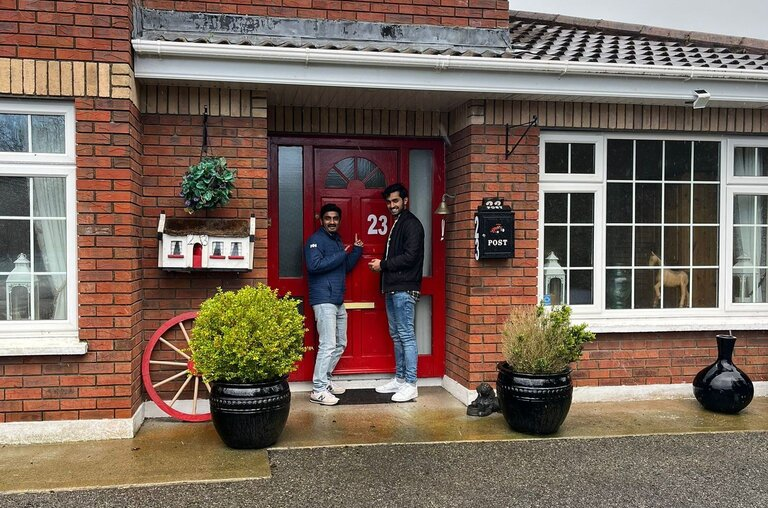

+++
title = "Cavan Pottering Retreat"
template = "index.html"
in_search_index = true
+++

# Welcome!

Welcome to Cavan Pottering Retreat! We provide (free) accommodation for travelers seeking a break and time away without breaking the bank in (semi-)rural Ireland. My friend and I live here, and we have two spare rooms available. 

> Pottering is the act of occupying oneself in a pleasant way but without a definite plan or purpose. 'Pleasant' implies comfort. 'Without a definite plan or purpose' implies freedom.
>
> The fundamentals of pottering are: make do with what you've got, don't try too hard, (minimal) movement, keep it local, keep it digital-free.
>
> (from Pottering: A Cure for Modern Life, Anna McGovern)

[Show me an example!](activities)

#### What do I get?
- Accommodation for upto 7 days and upto 2 people
  - A single room or a double room, with a large detached bathroom
  - A super-king size ensuite is available, but you'll have to pay a daily rate (**50 EUR/night**)
- Fresh towels, sheets
- Use of kitchen space, garden and utilities
- A separate living room with books, a desk and a chair, a couch, a fireplace, music

#### Where is it located?

In Cavan Town, Ireland. We're a 4 minute walk from Cavan Crystal Hotel ([Google Maps](https://maps.app.goo.gl/sawnoTwJzXxc9F75A)).

#### What's in Cavan?

365 lakes, us, and not much else. [Checkout a list of recommended activities, you'd be surprised](activities).

#### Is it really free?

Kind of, it's barter: we accept gifts and donations. Gifts can be anything--from a used book to a piece of furniture, or even something you think the house needs. You can donate after your stay as well, since you'll have a better idea of what the retreat needs. Check out our [guest wishlist](https://www.google.com) for some ideas. You could also help around the house, such as mow the lawn, spruce up the garden, or even do some DIY--only if you want to!

#### Is this an AirBnB?

This is not an AirBnB, so please do not expect hospitality or services. Think of this as upscale couchsurfing.

#### Is this in the countryside or in an urban area?

Neither, really. You can usually find cows grazing just a few meters away from our garden fence or take a 10 min drive to lakes and forests, but you can also walk 5 mins to a KFC or a 4-star hotel with a sauna and pool.

#### Why are you doing this?

1. We love the sense of community it creates
2. We wish this retreat existed while we were students without money
3. We like serendipity, gifts and (sometimes) new friends

#### Is it safe?

For you, yes. The house is in a safe residential area with many families, and a minute from the main highway where you can catch an hour-long bus to Dublin city.

For us, we're selective in who we share the retreat with: usually close friends, creative communities and closed groups where we have some acquaintances. Or even better, if you happen to meet us in person and we gave you the link to this page.
